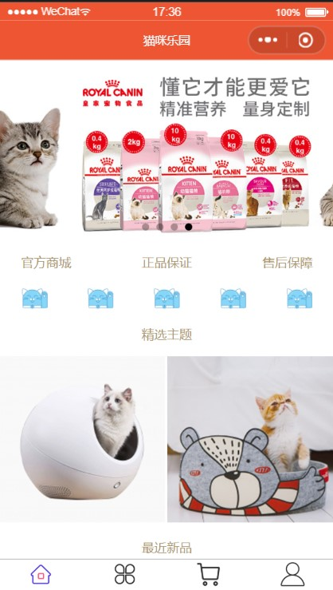
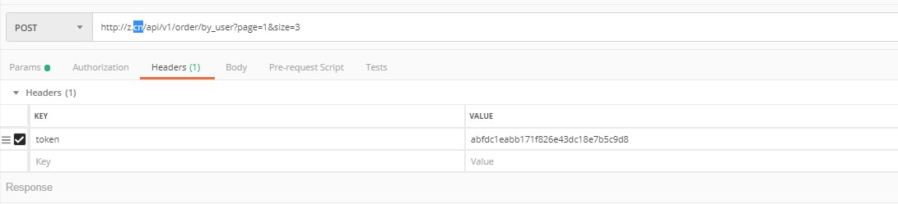

ThinkPHP 5.0
===============

ThinkPHP5在保持快速开发和大道至简的核心理念不变的同时，PHP版本要求提升到5.4，对已有的CBD模式做了更深的强化，优化核心，减少依赖，基于全新的架构思想和命名空间实现，是ThinkPHP突破原有框架思路的颠覆之作，其主要特性包括：

 + 基于命名空间和众多PHP新特性
 + 核心功能组件化
 + 强化路由功能
 + 更灵活的控制器
 + 重构的模型和数据库类
 + 配置文件可分离
 + 重写的自动验证和完成
 + 简化扩展机制
 + API支持完善
 + 改进的Log类
 + 命令行访问支持
 + REST支持
 + 引导文件支持
 + 方便的自动生成定义
 + 真正惰性加载
 + 分布式环境支持
 + 更多的社交类库

> ThinkPHP5的运行环境要求PHP5.4以上。

详细开发文档参考 [ThinkPHP5完全开发手册](http://www.kancloud.cn/manual/thinkphp5)

## 目录结构

初始的目录结构如下：

~~~
www  WEB部署目录（或者子目录）
├─application           应用目录
│  ├─api  
│  │  ├─behavior       CORS跨域
│  │  ├─controller
│  │  ├─model         
│  │  ├─service      
│  │  └─validate       验证器
│  │
│  │
│  ├─extra
│  ├─lib
│  ├─extend
│  ├─log                日志文件
│  ├─common             公共模块目录（可以更改）
│  ├─module_name        模块目录
│  │  ├─config.php      模块配置文件
│  │  ├─common.php      模块函数文件
│  │  ├─controller      控制器目录
│  │  ├─model           模型目录
│  │  ├─view            视图目录
│  │  └─ ...            更多类库目录
│  │
│  ├─command.php        命令行工具配置文件
│  ├─common.php         公共函数文件
│  ├─config.php         公共配置文件
│  ├─route.php          路由配置文件
│  ├─tags.php           应用行为扩展定义文件
│  └─database.php       数据库配置文件
│
├─public                WEB目录（对外访问目录）
│  ├─index.php          入口文件
│  ├─router.php         快速测试文件
│  └─.htaccess          用于apache的重写
│
├─thinkphp              框架系统目录
│  ├─lang               语言文件目录
│  ├─library            框架类库目录
│  │  ├─think           Think类库包目录
│  │  └─traits          系统Trait目录
│  │
│  ├─tpl                系统模板目录
│  ├─base.php           基础定义文件
│  ├─console.php        控制台入口文件
│  ├─convention.php     框架惯例配置文件
│  ├─helper.php         助手函数文件
│  ├─phpunit.xml        phpunit配置文件
│  └─start.php          框架入口文件
│
├─extend                扩展类库目录
├─runtime               应用的运行时目录（可写，可定制）
├─vendor                第三方类库目录（Composer依赖库）
├─build.php             自动生成定义文件（参考）
├─composer.json         composer 定义文件
├─LICENSE.txt           授权说明文件
├─README.md             README 文件
├─think                 命令行入口文件
~~~

> router.php用于php自带webserver支持，可用于快速测试
> 切换到public目录后，启动命令：php -S localhost:8888  router.php
> 上面的目录结构和名称是可以改变的，这取决于你的入口文件和配置参数。

## 命名规范

`ThinkPHP5`遵循PSR-2命名规范和PSR-4自动加载规范，并且注意如下规范：

### 目录和文件

*   目录不强制规范，驼峰和小写+下划线模式均支持；
*   类库、函数文件统一以`.php`为后缀；
*   类的文件名均以命名空间定义，并且命名空间的路径和类库文件所在路径一致；
*   类名和类文件名保持一致，统一采用驼峰法命名（首字母大写）；

### 函数和类、属性命名

*   类的命名采用驼峰法，并且首字母大写，例如 `User`、`UserType`，默认不需要添加后缀，例如`UserController`应该直接命名为`User`；
*   函数的命名使用小写字母和下划线（小写字母开头）的方式，例如 `get_client_ip`；
*   方法的命名使用驼峰法，并且首字母小写，例如 `getUserName`；
*   属性的命名使用驼峰法，并且首字母小写，例如 `tableName`、`instance`；
*   以双下划线“__”打头的函数或方法作为魔法方法，例如 `__call` 和 `__autoload`；

### 常量和配置

*   常量以大写字母和下划线命名，例如 `APP_PATH`和 `THINK_PATH`；
*   配置参数以小写字母和下划线命名，例如 `url_route_on` 和`url_convert`；

### 数据表和字段

*   数据表和字段采用小写加下划线方式命名，并注意字段名不要以下划线开头，例如 `think_user` 表和 `user_name`字段，不建议使用驼峰和中文作为数据表字段命名。

## 参与开发

请参阅 [ThinkPHP5 核心框架包](https://github.com/top-think/framework)。

## 小程序界面图

## 请求接口

首页【GET】

* 首页轮播图：[http://47.102.220.78/api/v1/banner/1/](http://47.102.220.78/api/v1/banner/1)

* 专栏分类：[http://47.102.220.78/api/v1/theme?ids=1,2,3](http://47.102.220.78/api/v1/theme?ids=1,2,3)

* 专栏里面的元素【指定专栏1，2，3】：[http://47.102.220.78/api/v1/theme/1/](http://47.102.220.78/api/v1/theme/1)

* 最新的产品：[http://47.102.220.78/api/v1/product/recent](http://47.102.220.78/api/v1/product/recent)

分类【GET】
* 所有分类：[http://47.102.220.78/api/v1/category/all/](http://47.102.220.78/api/v1/category/all)

* 分类里面的内容【2，3，4，5，6，7】：[http://47.102.220.78/api/v1/product/by_category?id=7](http://47.102.220.78/api/v1/product/by_category?id=7)

* 商品详情对id进行规则的限定判断：[http://47.102.220.78/api/v1/product/11/](http://47.102.220.78/api/v1/product/11)

关于Token令牌【POST】

* 根据code获取token令牌：[http://47.102.220.78/api/v1/token/user](http://47.102.220.78/api/v1/token/user)

~~~
    {"code":"0232ncQV06HrX021eJRV0dg3QV02ncQs"}
~~~
* 重新获取token【传入token验证是否过期】：[http://47.102.220.78/api/v1/token/verify](http://47.102.220.78/api/v1/token/verify)

* cms第三方应用获取token令牌ac=：ac se = :secret：[http://47.102.220.78/api/v1/token/app](http://47.102.220.78/api/v1/token/app)

个人中心

* 收货地址【post需要传一个token】：[http://47.102.220.78/api/v1/address](http://47.102.220.78/api/v1/address)

* 获取用户的收货地址【get需要传一个token】：[http://47.102.220.78/api/v1/address](http://47.102.220.78/api/v1/address)

* 下单接口【post要有token 】：[http://47.102.220.78/api/v1/order](http://47.102.220.78/api/v1/order)
~~~
        pay: function () {
           var token = wx.getStorageSync('token');
          //  var token = '70a640a7e86437ccf0b5c205e51423f6';
          console.log(token);
          var that = this;
          // that.getPreOrder(token, 'A303256065493535')
          wx.request({
            url: baseUrl + '/order',
            header: {
              token: token
            },
            data: {
              products:
              [
                {
                  product_id: 1, count: 5
                },
                // },
                {
                  product_id: 2, count: 1
                }
              ]
            },
            method: 'POST',
            success: function (res) {
              console.log(res.data);
              if (res.data.pass) {
                wx.setStorageSync('order_id', res.data.order_id);
                that.getPreOrder(token, res.data.order_id);
              }
              else {
                console.log('订单未创建成功');
              }
            }
          })
        },
~~~

* 订单详情接口【GET】：[http://47.102.220.78/api/v1/order/1/](http://47.102.220.78/api/v1/order/1)

* 历史订单接口【GET】：[http://47.102.220.78/api/v1/order/by_user](http://47.102.220.78/api/v1/order/by_user)

*  获取cms订单接口【GET】：[http://47.102.220.78/api/v1/order/paginate](http://47.102.220.78/api/v1/order/paginate)

* cms发货接口【put】：[http://47.102.220.78/api/v1/order/delivery](http://47.102.220.78/api/v1/order/delivery)

支付接口【没有商户号无发进行测试】

* 支付接口【post】：[http://47.102.220.78/api/v1/pay/pre_order](http://47.102.220.78/api/v1/pay/pre_order)

* 回调api接口：[http://47.102.220.78/api/v1/pay/notify](http://47.102.220.78/api/v1/pay/notify)

## 项目说明
* 这个项目是看了慕课上七月老师的课程，边看边写的每个接口都是敲好在进行调试，最后cms的【模板消息】只是看了自己比较弱没有看明白这个课程让我了解到实际开发的流程，还没改成属于自己的项目。这个项目涉及到AOP和ORM思想这是之前没有接触到的东西，自己有点晚接触到
这一些东西。

* 知道了什么是事务锁，跨域，并把它部署在阿里云用的是Centos7 lamp 域名备案服务器需要三个月才可以，没办法将http转https,小程序访问只能是https

## 版权信息

ThinkPHP遵循Apache2开源协议发布，并提供免费使用。

本项目包含的第三方源码和二进制文件之版权信息另行标注。

版权所有Copyright © 2006-2018 by ThinkPHP (http://thinkphp.cn)

All rights reserved。

ThinkPHP® 商标和著作权所有者为上海顶想信息科技有限公司。

更多细节参阅 [LICENSE.txt](LICENSE.txt)
